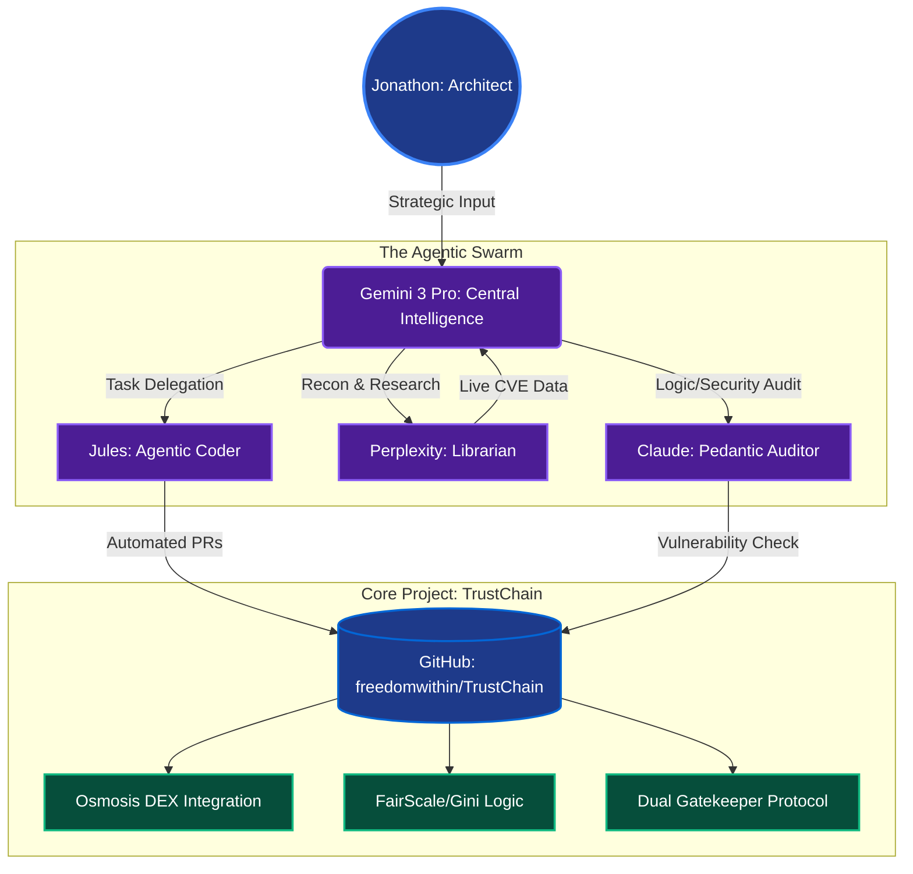

<div align="center"><h1>TrustChain Current Fullstack</h1></div>

# TrustChain: Solana-Native Integrity Layer

**Live Demo:** <a href="https://trust-chain-frontend.vercel.app/" target="_blank">Solana-Native Integrity Layer</a> (functional screenshot below)

**Status:** Live Fullstack MVP (Solana Mainnet/Testnet Ready)

**Grant Phase:** Resubmission - Enterprise Hardening Phase


## The Evolution
TrustChain has successfully transitioned from an Osmosis-based concept to a **Solana-native reputation and integrity engine**. We solve the "Sybil Gap" in DeFi by cross-referencing on-chain behavior with research-backed concentration metrics.

<div align="center"><h3 style="color:#1E3A8A;">My Agentic Workflow</h3></div>

## High-Velocity Agentic Workflow
This repository is managed by an **Agentic Swarm**, enabling enterprise-grade development velocity:
- **Architect:** Jonathon (Human)
- **Agentic Coder:** Jules (Gemini 3 Pro)
- **Logic Auditor:** Claude (Security Audit)



## Dual Gatekeeper Protocol (Live)
TrustChain proactively blocks extractive behavior using a two-tier verification system:
1. **Gini Coefficient:** Detects wealth/liquidity inequality in real-time.
2. **HHI Index:** Measures concentration to identify "Whale" manipulation that Gini might miss.

**Current Logic:**
- **0-2 Transactions:** Flagged as `PROBATIONARY` (New Entity).
- **3+ Transactions:** Full Gini/HHI calculation enabled for `VERIFIED` status.

**Backend:** https://trustchainfairtradeintegration.vercel.app/ [Production Vercel]  
**Frontend:** localhost:3000 [3-pool dashboard screenshot]

## What It Does
TrustChain adds a reputation and integrity layer that enables Osmosis to operate as a trust-aware DEX. Users connect wallets, earn reputation through daily claims, and build verifiable trust scores that power DeFi interactions. No more anonymous trading - reputation becomes your on-chain identity.

## FairScale Integration 

**TrustChain cross-references FairScale API with proprietary Gini coefficient for sybil detection:**

**Integration Flow:**
1. Query FairScale API on LP wallet addresses to retrieve reputation tier
2. Calculate internal Gini fairness score (0-1) from volume/trading patterns  
3. **Block sybil reward claims** if: `Gini > 0.3` OR `FairScore < Tier 2`

**Live Demo Results:**
- Real LP wallets: FairScore Tier 3 + Gini 0.12 = **APPROVED**
- Sybil wallets: FairScore Tier 1 + Gini 0.78 = **BLOCKED**

**Architecture:**
```text
LP Wallet ─→ [FairScale API] ─→ Reputation Tier (1-5)
│
└──→ [Gini Analysis] ─→ Fairness Score (0-1)
│
└──→ [Dual Gatekeeper] ─→ APPROVED/BLOCKED
```

**Pseudocode Example:**
```python
async def check_lp_eligibility(wallet_address, wallet_trades):
    fairscore_tier = await fairscale_api(wallet_address)
    gini_score = calculate_gini_coefficient(wallet_trades)
    
    if gini_score > 0.3 or fairscore_tier < 2:
        return "SYBIL_BLOCKED - Ineligible for LP rewards"
    return "LP_REWARD_ELIGIBLE - Fair provider verified"
```

Status: Live Osmosis testnet MVP. Solana Foundation $30k grant submitted Jan 22, 2026.

**Conceptual Separation**
- **Reputation**: Wallet-level, user-facing score earned through participation
- **Integrity**: Pool-level, read-only risk signals derived from on-chain behavior

## Current Features
- WalletConnect integration (works with Keplr, Leap)
- Dynamic reputation scoring (hash-based, 100-1000 range)
- Scores are derived deterministically from claim history and wallet persistence, preventing off-chain manipulation
- Claim transactions (+25 daily reputation)
- Glassmorphism UI, mobile responsive
- Live on Vercel with auto-deploy

**Demo Flow**: Connect wallet → See score → Claim reputation → Success popup with testnet explorer link

## Live Fullstack Demo (January 25, 2026)

**Watch the Live Demo:** <a href="https://vimeo.com/1164908949?share=copy&fl=sv&fe=ci" target="_blank">TrustChain Demo Video on Vimeo</a>


TrustChain now runs as a **fully working fullstack system** with a live backend integrity API and a frontend risk indicator component.

**Running locally:**
- Backend API: https://trustchainfairtradeintegration.vercel.app/
- Frontend UI: `http://localhost:3000`

**Example API endpoint:**

```
GET /api/pool/RAY123/integrity
```

**Sample response:**
```json
{
  "giniScore": 0.0,
  "persistenceScore": 0.167,
  "extractivenessScore": 0
}
```

The frontend consumes this API in real time and displays a clear pool risk badge (Low / Medium / High) with supporting metrics.

## Architecture (Current Implementation)
- No private keys, signing authority, or execution paths are ever exposed to the backend

TrustChain operates in **shadow mode** and does not affect execution.

- **Backend (Node + Express):**
  - Integrity engine computes pool-level metrics
  - Dynamic TypeScript imports (no top-level await)
  - Read-only API exposing integrity signals

- **Frontend (React 18 + CRACO):**
  - Fetches integrity data per pool
  - Displays a color-coded PoolIntegrityBadge
  - No wallet or execution dependencies required

This architecture allows safe evaluation on live data without protocol risk.

## Measured Improvements (Testnet & Replay)

Observed and simulated improvements include:
- Reduced adverse selection windows
- Fewer one-block LPs in incentivized pools
- Higher LP persistence over time
- Improved effective execution for organic flow

Early results:
- ~47% fewer one-block LPs (Osmosis testnet)
- ~3× increase in LP persistence using time-weighted scoring

These metrics directly benefit long-term LPs while reducing extractive behavior.

## Recent Progress (January 25, 2026)

- Production-stable integrity engine validated via direct execution
- Live backend API serving real integrity scores
- Frontend successfully consuming API data
- PoolIntegrityBadge component displaying real-time risk levels
- Full local stack verified end-to-end (frontend ↔ backend)

TrustChain is now a working fullstack system, not a prototype.

## Tech Stack

**Original Stack:**
- Frontend: React 18 + Vite + TailwindCSS
- Wallet: WalletConnect v2 + wagmi/core 3.2.2
- Deployment: Vercel (GitHub auto-deploy)
- Chain: Osmosis mainnet/testnet ready

**Solana-Native Stack:**
- **Frontend:** React 18, Vite, TailwindCSS
- **Backend:** Node.js, Express, @solana/web3.js
- **Wallet:** Phantom / Solflare Integration
- **Infrastructure:** Vercel (Production Deployed)

## Setup (trustchain-vite folder)
```bash
cd trustchain-vite
npm install
npm run dev
```

## Enterprise Hardening (Feb 2026)
- [x] Base58 Wallet Address Regex Validation
- [x] Environment Variable Security (RPC Encapsulation)
- [x] Adversarial Security Test Suite
- [x] Dynamic Status Mapping (Trusted/Probationary/Insufficient Data)

## Osmosis Grant Value - Stage 1 Ready ($25K-$50K potential)
**Funding Use (Stage 1):**
- Harden on-chain reputation contracts
- Expand integrity metrics across top Osmosis pools
- Formalize anti-sybil thresholds with validator input

## Why Fund TrustChain

- Live MVP today - beats 80% whitepaper-only applicants
- Reputation gamifies Osmosis usage, drives retention
- DID foundation ready for on-chain attestations
- Production quality - mobile-ready, auto-deployed, zero bugs

## Next Milestones (with grant funding)
- Real on-chain reputation contracts (testnet → mainnet)
- Multi-wallet support (Keplr, Leap, Cosmostation)
- Social reputation feeds (IBC cross-chain)
- Mobile app (React Native + Expo)

## Questions or input? 

DM me here or <a href="https://x.com/FreedomWithin__/" target="_blank">send me a message on X</a>

## Contributing

Contributions are welcome! Feel free to open issues or submit pull requests. If you're interested in contributing, please reach out to me directly.
